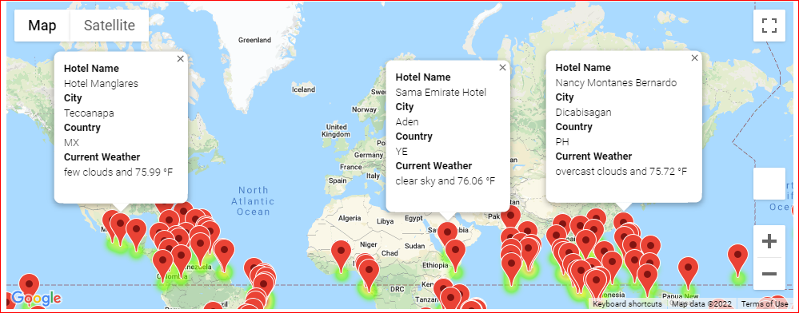
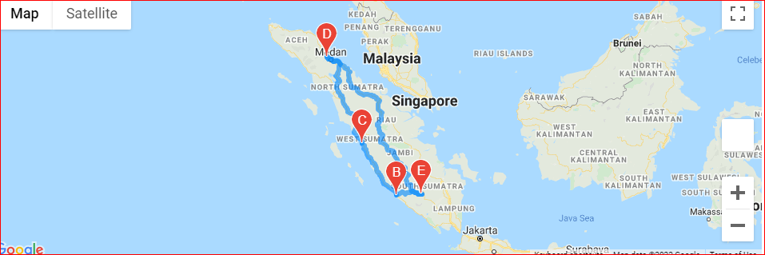
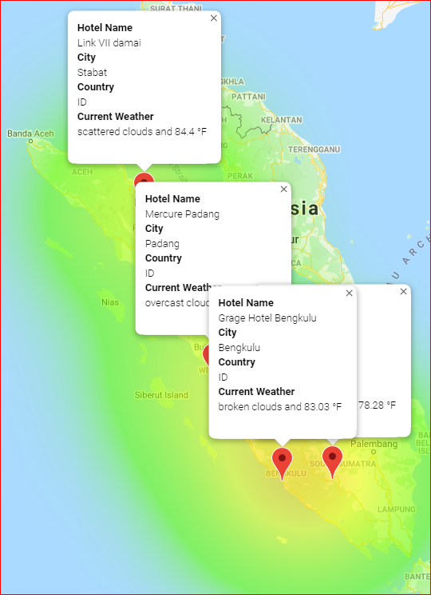

# World-Weather_Analysis
## Purpose of the repository :
1. Weather Database:

   * Using random number function, created 2000 latitude & longitudes pairs.
   * Using Citipy, found the nearest city from longitudes & latitude and added to the city list.
   * Using openweathermap, created city dataframe for the cities found in open weather map. 
   * Saved the dataframe to a csv file (WeatherPy_Database).

2.  Database of Hotels for the cities in the WeatherPy database :

    * Users are prompted to enter their preference of low & high temperature, at the location of the vacation.
    * Created new DataFrame of cities meeting the temperature range (low & high temperature) by user. Dropped the empty rows.
    * Retreived hotels for the cities meeting the above criteria, using GMAP function
    * Added the hotel name into the DataFrame & dropped the rows that didn't have hotel name.
    * The new DataFrame is saved as CSV file( WeatherPy_vacation).
    * Added a marker layer map with pop-up markers of the cities in the cities DataFrame.
    * Each marker included the hotel name, city, country, weather description & temperature.
    * Saved the map with marker as Weather_vacation_map.PNG.

3. Create Travel Itinerary Map:

    * Created four DataFrames for four cities in the same country.
    * Extracted the longitude & latitude of the cities from the dataframe.
    * Directional layer map between the four cities & travel map is created (saved the map as WeatherPy_travel_map.PNG).
    
    * A marker layer map with a pop-up marker( hotel name, city, country , weather description & temperature) for the cities on the itinerary is created ( saved the map as WeatherPy_travel_map_marker.PNG).
    
